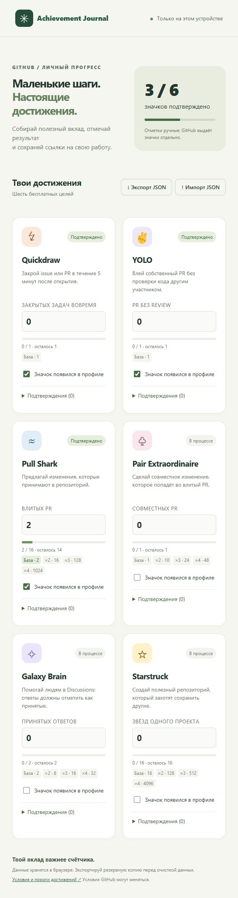

# Achievement Journal

A small, local-first journal for GitHub achievements. Russian interface, no account, token or server required.

**[Open the demo](https://brokenasf.github.io/achievement-journal/)** · [User guide](docs/USAGE.md) · [Contributing](CONTRIBUTING.md)



This project records progress manually. It does not unlock achievements or automatically verify GitHub activity.

- Six free achievement goals and their tier thresholds.
- Independent counters, badge confirmation and GitHub evidence links.
- Device-local storage with validated JSON backup and recovery.
- Responsive Russian interface with keyboard-accessible controls.
- Python CLI for checked PR delivery and progress estimates.

## Development

Requires Node.js 20 or newer. No dependencies to install.

```sh
npm start
npm test
```

Open http://127.0.0.1:4173. Public site files live in `dist/`.

## Automate the contribution workflow

The [Python CLI](docs/AUTOMATION.md) checks changes, opens PRs, waits for CI, optionally merges them and reports achievement tier estimates. It supports a queue of prepared changes and resumes existing PRs. It uses no third-party Python dependencies and never creates empty contributions.

```sh
python scripts/achievements.py status
python -m unittest discover -s tests -p "test_*.py"
```

## Hosting

Serve `dist/` using any static HTTP host. No build step or backend is required. The included GitHub Pages workflow publishes `dist/` after JavaScript tests pass on `main`. Different hosting origins keep separate journals; export/import to transfer them.

## License

[MIT](LICENSE). Not affiliated with GitHub. Achievement criteria may change.
